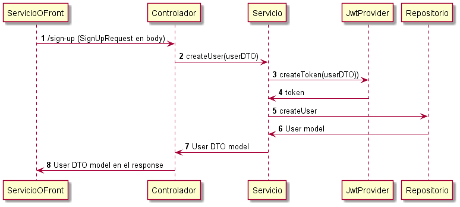
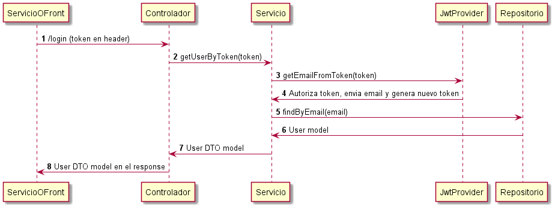

## Getting Started

Como empezar a usar el microservicio.

### Prerequisites

* Java 8


### Installation

Instrucciones para  la instalacion del microservicio.
1. Abrir la consola y posicionarse en la carpeta elegida. 
      ```sh
   cd C:\User\miCarpeta
   ```
2. Clonar el repositorio en la carpeta elegida
   ```sh
   git clone https://github.com/iancrespiok/user_java_microservice
   ```
3. Posicionarse en la carpeta del repositorio
   ```sh
   cd user_java_microservice
   ```
4. Buildea la aplicacion
   ```js
   gradlew build
   ```
4. Ejecuta la aplicacion
   ```js
   gradlew bootRun
   ```

## Diagrama de componentes

El microservicio expone una API Rest para que otro servicio o un FrontEnd puedan consumirlo.


## Endpoints
La aplicacion ha sido alojada en el localhost en el puerto 8080 y esta disponible para ser requerida con los siguientes endpoints:


### POST /sign-up


* Contrato de entrada en el body:
```yaml
{
   "name": String,
   "email": String,
   "password": String,
   "phones": [
      {
         "number": long,
         "citycode": int,
         "contrycode": String
      }
   ]
}
```
Respuesta en caso de datos cumpliendo requisitos:
```yaml

{
   "id": "e5c6cf84-8860-4c00-91cd-22d3be28904e",
   "created": "Nov 16, 2021 12:51:43 PM",
   "lastLogin": "Nov 16, 2021 12:51:43 PM",
   "token": "eyJhbGciOiJIUzI1NiJ9.eyJzdWIiOiJqdWxpb0B0ZXN0...",
   "isActive": true,
   "name": "Julio Gonzalez",
   "email": "julio@testssw.cl",
   "password": "a2asfGfdfdf4",
   "phones": [
      {
         "number": 87650009,
         "citycode": 7,
         "contrycode": "25"
      }
   ]
}
```
Respuesta en caso de error:
```yaml
{
   "error": [
      {
         "timestamp": Timestamp,
         "codigo": int,
         "detail": String
      },
      {
         "timestamp": Timestamp,
         "codigo": int,
         "detail": String
      }]
}
```
Diagrama de secuencia


### GET /login

En el request debe enviarse el token recibido en el endpoint anterior en el header.

Respuesta en caso de datos cumpliendo requisitos:
```yaml

{
   "id": "e5c6cf84-8860-4c00-91cd-22d3be28904e",
   "created": "Nov 16, 2021 12:51:43 PM",
   "lastLogin": "Nov 16, 2021 12:51:43 PM",
   "token": "eyJhbGciOiJIUzI1NiJ9.eyJzdWIiOiJqdWxpb0B0ZXN0...",
   "isActive": true,
   "name": "Julio Gonzalez",
   "email": "julio@testssw.cl",
   "password": "a2asfGfdfdf4",
   "phones": [
      {
         "number": 87650009,
         "citycode": 7,
         "contrycode": "25"
      }
   ]
}
```
Respuesta en caso de error:
```yaml
{
   "error": [
      {
         "timestamp": Timestamp,
         "codigo": int,
         "detail": String
      },
      {
         "timestamp": Timestamp,
         "codigo": int,
         "detail": String
      }]
}
```
Diagrama de secuencia



